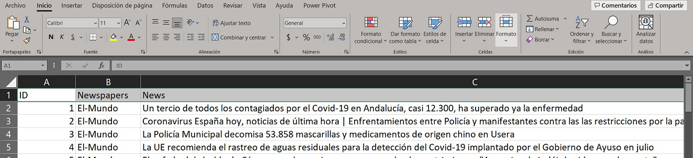
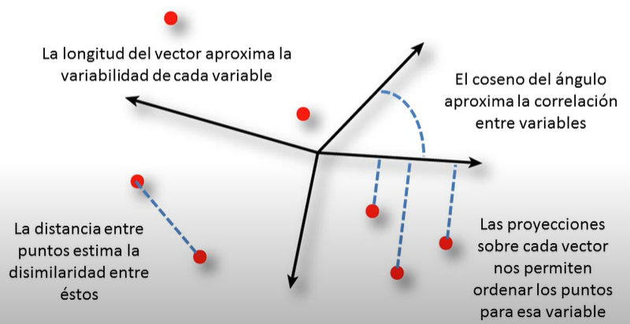

```{r setup, include=FALSE}
knitr::opts_chunk$set(
  collapse = TRUE,
  comment = "#>"
)
```


# Introducción

<div style="text-align: justify">
`LDABiplots` Es una herramienta de extracción, análisis y visualización para el análisis exploratorio de noticias publicadas en la web por diarios digitales, que mediante la extracción de datos desde la web (Bradley et al. 2019), permite implementar el modelo probabilístico Latent Dirichlet Allocation (LDA) (Blei, Ng y Jordán, 2003) y generar visualizaciones Biplot (Gabriel K.R, 1971) y HJ-Biplot (Galindo-Villardón P, 1986) de los principales temas de los titulares de las noticias publicadas en la web. `LDABiplots` permite optimizar la extracción de datos desde la web, la rutina del modelado LDA y la generación de visualizaciones Biplot de una forma interactiva para usuarios que no estén adaptados al uso de R.
<div/>


# Descarga e instalación 

Para descargar instalar la versión estable de la Comprehensive R Archive Network (CRAN)


```{r}
# install.packages("LDABiplots")
# library(LDABiplots)
```


Una vez cargada la libreria, para utilizar la interfaz web se digita en la consola de R

```{r}
# runLDABiplots()
```


# Importacion o Carga de Datos


<div style="text-align: justify">
`LDABiplots` nos permite extraer datos desde la pagina web *www.google.com*, los datos pertenecen a la sección notícias en el buscador GOOGLE. Para usuarios que usan una pagina diferente de extraccion `LDABiplots` tambien permite la carga de archivos en formato Excel.
<div/>


## Importacion de Datos desde Archivo 


<div style="text-align: justify">
Los datos se pueden importar desde un archivo en el directorio, seleccionando en la pestaña *Import or Load Data* la opcion de *Import excel file*, y seleccionar el archivo a subir desde *Browse* y la pestaña de trabajo donde se encuentren los datos *Worksheet Name*. (video 1). Los datos a subir deben de tener el encabezado y formato de acuerdo a la figura 1.
<div/>
.

```{r fig1,fig.cap='Figura 1. Formato de Archivo a Importar ',fig.align='center', echo=FALSE, out.width = '90%'}

```
.


<center>
<a href="https://www.youtube.com/watch?v=MHSPy31bgnI
" target="_blank"></a>
</center>


<center> Video 1. Importar Datos </center>


## Extraccion de Datos desde la WEB


<div style="text-align: justify">
Se recomienda antes de realizar la extraccion de noticias por medio del `LDABiplots`, configurar el buscador de google de su computador en *Busqueda avanzada*, configurar la región y el idioma de preferencia de busqueda en la sección de noticias para obtener mejores resultados de extracción.(Video 2)
<div/>
.

<center>
<a href="https://www.youtube.com/watch?v=bLTK_YKDeIg
" target="_blank"></a>
</center>


<center> Video 2. Configuración del Buscador </center>
.

<div style="text-align: justify">
Los datos se pueden extraer mediante el scrapeo web directamente en `LDABiplots`, seleccionando en la pestaña *Import or Load Data* la opcion de *Load web data*, y escribir las palabras claves de busqueda (usar maximo 4 palabras claves, para un mejor rendimiento de la busqueda, seleccionar el lenguaje de busqueda en *Choose Language*, y el numero de paginación a ser extraido, por defecto google muestra 10 noticias por paginas, seleccione *Run* para ejecutar la busqueda y extracción.(Video 3)
<div/>

.
<center>
<a href="https://www.youtube.com/watch?v=sLuKPQtX-Es
" target="_blank"></a>
</center>


<center> Video 3. Extracción Noticias desde la WEB </center>


# Ejemplo de Aplicación

<div style="text-align: justify">
Para ejemplificar el funcionamiento de `LDABiplots`,  extraeremos desde la web las noticias relacionadas a “*covid, coronavirus, France*”, de acuerdo a lo mostrado en el video 3, esta extracción nos permite listar en dos tablas el número de periódicos con su respectiva frecuencia de noticias, asi como también nos muestra cada uno de los periódicos con los titulares de las noticias, estas tablas pueden ser descargadas en varios formatos desde la aplicación, para el procesamiento de estos datos procederemos de la siguiente manera:

**Selección de Diarios Digitales a Analizar**, se recomienda seleccionar los diarios con noticias digitales de mayor frecuencia.

**Inclusión de n-gramas**, n-gramas es una secuencia contigua de palabras. De acuerdo con su estudio debe seleccionar entre *unigrams, bigrams o trigrams*, para el ejemplo se selecciona bigrams

**Remover números**, esta opción nos permite quitar los números, en el caso de que estos no sean informativos.

**Seleccionar lenguaje para las stopword**, las stopword son aquellas palabras que no tienes significado léxico y que aparecen con una alta frecuencia en las noticias, como artículos o pronombres. Se procedió a seleccionar de acuerdo con el lenguaje de extracción de las noticias, es decir en inglés.

**Adicionar palabras stopword**, esto nos permite eliminar del estudio palabras que se pueden considerar con alta frecuencia y que no aporten valor al estudio, en el ejemplo se añadió las palabras *covid* y *france*.

**Seleccionar Lematización**, esto nos permite reducir las palabras a la forma básica, debe de usarse con precaución en los estudios, para el ejemplo no se seleccionó la lematización.

**Seleccionar Sparcity**, nos permite eliminar términos que se usan con poca frecuencia en muy pocas noticias antes de generar los modelos. Permitiendo un mejor rendimiento computacional ya que elimina información que no aporta al modelo, para nuestro caso se usó *sparcity* con un 0.985(98.5%), es decir se generara el DTM con los términos que aparecen en las del 1.5% de los titulares de las noticias.

**Crear DTM**, finalmente se genera la matriz de términos del documento (DTM), una vez terminado el proceso, se muestra en una tabla resumen las dimensiones de la DTM, ver video 4.
<div/>
.
<center>
<a href="https://www.youtube.com/watch?v=xvB7Xo4jGcA
" target="_blank"></a>
</center>


<center> Video 4. Obtención de matriz DTM </center>


## Visualización de Matriz de Términos

<div style="text-align: justify">
Luego del tratamiento de los datos originales de los periódicos seleccionados se ha obtenido una matriz del corpus de 402 terminos únicos, de los 444 del corpus original, esto permite obtener un mejor rendimiento computacional para los siguientes análisis. La matriz DTM obtenida se puede observar al seleccionar *Document Term Matrix Visualization*, en la pestaña de *Data* de una manera tabular, pudiendo descargarse en diferentes formatos, tales como Excel, csv y pdf. Esta matriz DTM nos muestra las frecuencias de los términos, la cantidad de documentos en los que aparece cada termino y el IDF o frecuencia inversa de documentos que es una medida de la importancia del término.

La opción de *Barplot*, nos permite generar un grafico de barras ordenado, donde se visualiza las palabras de acuerdo con su frecuencia y permitiendo la opcion del cambio del color de las barras en el gráfico y de descarga del mismo en varios formatos con el boton *export*.
La Opción *Worcloud*, nos muestra una nube de palabras, el cual puede ser modificado, seleccionando el numero de palabras a mostrar, con el botón *export*, se puede descargar el grafico en varios formatos.

*Co-ocurrence* muestra una grafica de co-ocurrencia de las palabras el cual traza las correlaciones de términos dispersos como una estructura gráfica, basado en el procedimiento glasso (Grafica Lasso), para reducir la matriz de correlación y conservar solo las correlaciones relevantes entre términos, con la opción *Select Number* nos permite seleccionar el número de términos para la gráfica de correlación, y *Download the plot*, nos permite descargar el grafico en formato png y pdf. Visualizar video 5.
<div/>
.
<center>
<a href="https://www.youtube.com/watch?v=k_tSa5U935g
" target="_blank"></a>
</center>


<center> Video 5. Visualización de matriz DTM </center>

## Selección de k optimo.

<div style="text-align: justify">
Para la inferencia y selección del número de tópicos óptimo para el modelo LDA, partimos de la matriz DTM, teniendo en cuenta que un *K* pequeño puede generar tópicos amplios y heterogéneos, y un *K* alto producirá tópicos específico `LDABiplots` obtiene este k optimo a partir de la coherencia del tópico, siendo esto una medida de la calidad de un tópico deseado desde el punto de vista de la interpretabilidad humana. Esta se basa en la hipótesis de distribución que establece que las palabras con interpretaciones similares tienden a coexistir en contextos similares. El mejor número de tópicos será el que ofrezca la mayor medida de coherencia, esto lo realiza basado en la teoría de probabilidad y consiste en ajustar varios modelos con diferentes tópicos y calcular la coherencia de cada uno de ellos. Para la opción de este numero se debe de parametrizar los modelos que se quieren comprobar en la sección *Inference* en *Candidate number of topics K*, se debe de identificar desde  el rango de topicos para la prueba, en la sección de *Parameters control Gibbs sampling*, se deberá de seleccionar el número de iteraciones *Iteratition* del muestro basado en el muestreo de Gibbs y el numero de las primeras N muestras a descartar *Burn-in*, con el fin de que se elija un N que sea lo suficientemente grande.

Se debe seleccionar un valor del hyperparametro *Alpha*, considerando que un valor alfa alto significa que es probable que cada documento contenga una combinación de la mayoría de los tópicos, y no un solo tópico en particular. Un valor alfa bajo impone menos restricciones a los documentos y significa que es más probable que un documento contenga una combinación de solo unos pocos, o incluso solo uno, de los tópicos. Varios autores han definido algunas reglas para determinar el valor de alfa, *α = (0.1, 50/K)(Griffiths et al,2004), también (0.1, 0.1)(Asunción et al, 2009) y (1/K, 1/K)( Rehůřek and Sojka, 2010)*,  por defecto `LDABiplots` usa el valor de *0.1* para el cálculo, ver video 6.
<div/>
.
<center>
<a href="https://www.youtube.com/watch?v=dI6yUPJJbm4
" target="_blank"></a>
</center>

<center> Video 6. Obtención de K Óptimo </center>

## Obtención de Modelo LDA

<div style="text-align: justify">
Definido el número de temas, de acuerdo con la coherencia obtenida de 0.069 se infirió que el mejor número de tópicos es de 4, con este K optimo se precede a generar el modelo LDA a partir de la matriz DTM, con el numero K optimo se deberá de definir los parámetros similares al proceso donde se obtuvo la inferencia, para el ejemplo se seleccionó 100 iteraciones y un Burn-in de 5, asi como un Alpha de 0.1, luego de evaluar el K óptimo de acuerdo con las reglas determinadas. EL resultado obtenido con `LDABiplots` son dos matrices, la primera es la matriz Theta, la cual muestra en las columnas un identificador de las noticias de los periódicos analizados y en las filas una distribución de tópicos en los documentos analizados. Otra Matriz obtenida es la phi, la cual muestra en las filas que representan una distribución de palabras sobre los tópicos.

Ambas matrices pueden ser descargadas en la sección *Tabular result*, donde antes de descargar las matrices se puede seleccionar mediante una barra el número de términos *Select number of term*, seleccionar el número de etiquetas en *Select number of label*, y el valor de las asignaciones *Select Assignmets*, con el fin de parametrizar la cantidad de palabras y las etiquetas que se desean observar y descargar.

En *Worcloud* podemos observar mediante un gráfico de palabras, cuales dé están tienen mayor peso en cada uno de los tópicos. En *Heatmap* observamos mediante un mapa de calor las probabilidades de pertenencia a cada uno de los diarios, donde de acuerdo con la escala de colores mostrada se puede observar que tópicos se topan más en alguno de los diarios de noticias digitales en particular. 

En la pestaña de *Cluster*, se puede observar la agrupación de los tópicos encontrados, para lo cual se puede seleccionar el método de agrupación en *Agglomeration method* entre los métodos incluidos en el `LDABiplots` tenemos *complete, single, Ward.D, Ward.D2, average, mcquitty, median, centroid*, el método de varianza mínima de *Ward* tiene como objetivo encontrar grupos compactos y esféricos. El método de *complete* encuentra grupos similares. El método de *single* que está estrechamente relacionado con el árbol de expansión mínimo, adopta una estrategia de agrupación de *friend of friend*. Se puede considerar que los otros métodos apuntan a grupos con características en algún lugar entre los métodos de single y complete. Los métodos *median* y *centroid* no conducen a una medida de distancia monótona o, de manera equivalente. En la sección de *type of plot* se puede seleccionar el tipo de grafico a mostrar, se encuentran las opciones de *rectangle* el cual Dibuja rectángulos alrededor de las ramas de un dendograma resaltando los grupos correspondientes, *circular* que genera una gráfica de manera eficiente y optima con un agrupamiento circular heuristico y *phylogenic* que muestra mediante un árbol filogenético como los tópicos hipotéticos están relacionados entre sí, asi como una barra de desplazamiento para seleccionar el numero de cluster a realizar entre tópicos, el paquete permite descargar el plot en formato pdf o png. Ver video 7
<div/>
.
<center>
<a href="https://www.youtube.com/watch?v=BZujNAjs5b4
" target="_blank"></a>
</center>

<center> Video 7. Modelo LDA y Representaciones </center>

## Representaciones Biplots

<div style="text-align: justify">
Los gráficos Biplot aproximan la distribución de una muestra multivariante en un espacio de dimensión reducida, y superpone sobre la misma representaciones de las variables sobre las que se mide la muestra, este grafico permite mostrar gráficamente la información de las filas (representado por puntos, marcadores filas) y columnas (representado por Vectores, marcadores columnas), `LDABiplots`, nos permite mostrar gráficamente y tabularmente los resultados obtenidos al procesar los Biplots, seleccionamos el Biplot deseado entre el *JK-Biplot*, donde las coordenadas de las filas son las coordenadas sobre las componentes principales y las coordenadas de las columnas son los vectores propios de la matriz de covarianzas o de correlaciones. Las distancias euclídeas entre los puntos fila en el Biplot aproximan las distancias euclídeas entre filas en el espacio multidimensional. O el *GH-Biplot*, donde las coordenadas de las filas están estandarizadas y la distancia entre filas aproxima la distancia de Mahalanobis en el espacio multidimensional. Y el *HJ-Biplot* que genera una alta calidad de representación tanto para filas como para las columnas, al presentar ambas idéntica bondad de ajuste es posible la interpretación de la relacion fila-columna.

Para nuestro ejemplo se seleccionó el HJ-Biplot, para la interpretación se consideran las siguientes reglas: Ver figura 2.
<div/>
.
```{r fig2,fig.cap='Figura 2. Interpretación HJ-Biplot ',fig.align='center', echo=FALSE, out.width = '50%'}

```

Donde;
<div style="text-align: justify">
-	Las distancias entre los marcadores filas se interpreta como una función inversa de sus similaridades, de tal forma que marcadores próximos son más similares

-	La longitud de los vectores (marcadores columna) aproximan la desviación típica de los diarios de noticias.

-	Los cosenos de los ángulos entre los marcadores columna aproximan las correlaciones entre los Diarios, ángulos agudos asocian alta correlación positiva entre estos, ángulos obtusos indican correlación negativa y ángulos rectos señalan variables no correlacionadas.

-	El orden de las proyecciones ortogonales de los puntos (marcadores fila) sobre un vector (marcador columna) aproxima el orden de los elementos fila (centros) en esa columna. Cuanto mayor es la proyección de un punto sobre un vector, más se desvía el centro de la media de ese diario.

Antes de seleccionar la generación de la representación Biplot a realizarse se debe de marcar como se realizará el centrado de la matriz de covarianzas, LDABiplots nos da 4 opciones de centrado y escalado de la matriz, tales como: *scale*, *center*, *center_scale*, o *none*.

Al hacer click en *run*, se generara el Biplots seleccionado y los resultados en forma tabular, los cuales se pueden descargar en diferentes formatos, los resultados tabulares que se muestran son: *Eigenvalues* los vectores con los valores propios, *Variance explained* un vector que contiene la proporción de varianza explicada por los primeros 1, 2,.,K componentes principales obtenidos,*loadings* Las cargas de los componentes principales, *Coordinates of individuals* matriz con las coordenadas de los individuos, *Coordinates of variables* matriz con las coordenadas de las variables.

En la pestaña *Biplot*, se encontrará la representación gráfica generada de acuerdo a los parámetros previos seleccionados, el gráfico puede ser modificado en su forma, con las diferentes opciones que brinda el paquete, se puede modificar en la sección *Options to Customize the Biplot*, el *theme*, los ejes a mostrar en *Axis-X* y en *Axis-Y*, el color de los marcadores columnas y el color de los marcadores filas, también se puede cambiar el tamaño de los marcadores y agregar en diferente tamaños las etiquetas de ambos marcadores. La representación se puede descargar en formato png o pdf. Ver video 8
<div/>
.
<center>
<a href="https://www.youtube.com/watch?v=Elw_UtuXEb4
" target="_blank"></a>
</center>

<center> Video 8. Representaciones Biplot </center>

## Citation


Si usa `LDABiplots`, por favor cítelo en su trabajo como:

<div style="text-align: justify">
*Pilacuan-Bonete L., Galindo-Villardón P., De la Hoz-M J., & Delgado-Álvarez F.(2022). LDABiplots: Biplot Graphical Interface for LDA Models. R package version 0.1.2.*
<div/>

## Referencias
<div style="text-align: justify">
*Blei, D. M., Ng, A. Y., & Jordan, M. I. (2003). Latent dirichlet allocation. Journal of machine Learning research, 3(Jan), 993-1022.*

*Galindo-Villardón,P. (1986). Una alternativa de representación simultánea: HJ-Biplot (An alternative of simultaneous representation: HJ-Biplot). Questíio 1986, 10, 13–23.*

*Gabriel, K. R. (1971). The biplot graphic display of matrices with application to principal component analysis. Biometrika, 58(3), 453-467.*

*Griffiths, T. L., & Steyvers, M. (2004). Finding scientific topics. Proceedings of the National academy of Sciences, 101(suppl 1), 5228-5235.*
<div/>
